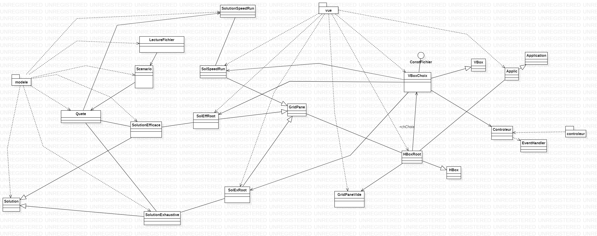
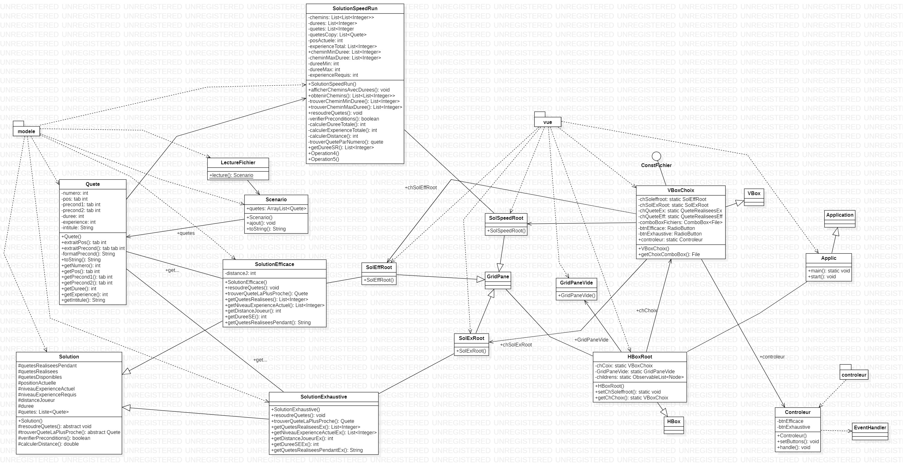

### David Grondin & Enola VAYSSIERE INF 1 

# SAE 2_01 & 2_02

**I] Introduction**

&nbsp;&nbsp;&nbsp;
Dans notre projet, nous avons interprété plusieurs scénarios d'un jeu RPG pour déterminer différentes informations, telles que le temps nécessaire pour terminer le jeu selon différents profils de joueurs. Nous avons créé une application JavaFX qui génère une interface montrant les chemins parcourus lors des quêtes. Pour cela, nous avons utilisé un modèle simplifié avec une carte 2D où les mouvements sont limités à l'horizontal et au vertical, chaque mouvement prenant 1 unité de temps. Cette approche nous permet d'analyser la durée de vie du jeu en tenant compte des déplacements du joueur et de l'interaction avec l'environnement. Ces résultats contribueront au développement et à l'amélioration des jeux vidéo RPG en monde ouvert.

**II] La qualité de développement**

&nbsp;&nbsp;&nbsp;
Pour ce travail, nous avons réparti les tâches équitablement entre nous. David s'est occupé d'une partie des classes Java, tandis qu'Enola s'est occupée de l'autre partie. Ensuite, David s'est chargé des tests et Enola de l'interface utilisateur (IHM). Cependant, il est important de souligner que nous nous sommes entraidés lorsque des problèmes survenaient.

Cette répartition des tâches équitablement nous a permis d'optimiser notre productivité et d'avancer plus rapidement dans le projet. En travaillant sur des parties distinctes du code, nous avons pu nous concentrer sur leurs domaines d'expertise respectifs, ce qui a contribué à la qualité globale du travail réalisé.

Notre approche collaborative et équitable a renforcé notre collaboration, afin de résoudre les problèmes efficacement et favoriser un environnement de travail positif. Cela fut bénéfique au projet, en exploitant nos forces et compétences respectives tout en cultivant un esprit d'équipe solide.

&nbsp;&nbsp;&nbsp;
Dans le cadre de notre projet, nous avons utilisé plusieurs outils et services pour faciliter le développement et la collaboration. Parmi ces outils, nous avons utilisé Git, IntelliJ et Discord.
Git afin de gérer notre code source et suivre les modifications tout au long du projet, permettant ainsi un travail simultané sur différentes fonctionnalités et la fusion sécurisée des modifications.
IntelliJ pour coder et tester nos classes tout au long de la SAE.
De plus, Discord facilite la communication et la collaboration hors établissement scolaire. 
Enfin, l'utilisation de Git, IntelliJ et Discord a été essentielle pour le succès de notre projet. Git nous a permis de gérer les modifications du code, IntelliJ nous a fourni un environnement de développement puissant et Discord nous a permis de communiquer hors établissement. Ces outils ont amélioré notre productivité, renforcé la collaboration et facilité la coordination de notre équipe de développement.

&nbsp;&nbsp;&nbsp;
Nous avons utilisé la méthode en cascade, une approche de développement logiciel linéaire et séquentielle. Cette méthode consiste en des phases distinctes, allant de l'analyse des besoins à la maintenance, suivies dans un ordre préétabli. Elle nous a permis de progresser de manière structurée et prévisible, en assurant une gestion rigoureuse des délais et des coûts. Cependant, il convient de noter que cette méthode peut être moins flexible en cas de changements ou d'évolutions des exigences.

Nous avons utilisé la méthode en cascade, une approche de développement logiciel linéaire et séquentielle. Cette méthode consiste en des phases distinctes, allant de l'analyse des besoins à la maintenance, suivies dans un ordre préétabli. Elle nous a permis de progresser de manière structurée et prévisible, en assurant une gestion rigoureuse des délais et des coûts. Cependant, il convient de noter que cette méthode peut être moins flexible en cas de changements ou d'évolutions des exigences.

**III]  La conception générale**

Voici le diagramme de classes de haut niveau contenant les classes et les relations entre les classes. 

Voici le diagramme des classes détaillé pour chaque composant : modèle, vue et contrôleur.

Nous avons mis en place différentes structures de données et stratégies algorithmiques pour résoudre efficacement les problèmes rencontrés. Voici une présentation de certaines d'entre elles :

Tableaux (Arrays) : Les tableaux sont des structures de données linéaires qui stockent des éléments de manière contiguë en mémoire. Nous en avons notament utilisé dans la classe "Scenario". 

Collections : Les collections sont un ensemble de structures de données préexistantes pour stocker et manipuler des collections d'objets. Par exemple, nous l'avons utilisé dans la classe "SolutionEfficace".

Liste (List) : Une liste est une structure de données qui peut contenir une séquence d'éléments. Différentes implémentations de listes existent, telles que les listes chaînées, les listes à tableaux dynamiques (ArrayList) et les listes liées (LinkedList). Nous avons principalement utilisé des ArrayList, par exemple dans la classe "Solution".

**III]  Conclusion**

En conclusion, notre équipe a accompli avec succès le niveau 1 de la SAE202 et nous sommes sur le point de finaliser le niveau 2 (nous n'avons pas tous les informations en sortie). Dans le cadre de la SAE201, nous avons réalisé une interface conviviale pour le niveau 1 ainsi que le niveau 2, offrant aux utilisateurs la possibilité de choisir le scénario et la méthode à utiliser. 
Malgré notre désir d'une interface plus détaillée et professionnelle, nous sommes fiers du travail accompli. Nous avons créé une interface conviviale permettant aux utilisateurs de choisir le scénario et la méthode. Bien que nous aurions souhaité inclure plus de détails sur les calculs, nous avons fait de notre mieux compte tenu des contraintes de temps. Notre équipe a mis en œuvre des fonctionnalités solides et a acquis des connaissances précieuses tout au long du processus. Bien que nous reconnaissions qu'il y a toujours place à l'amélioration, nous sommes satisfaits des résultats obtenus.
